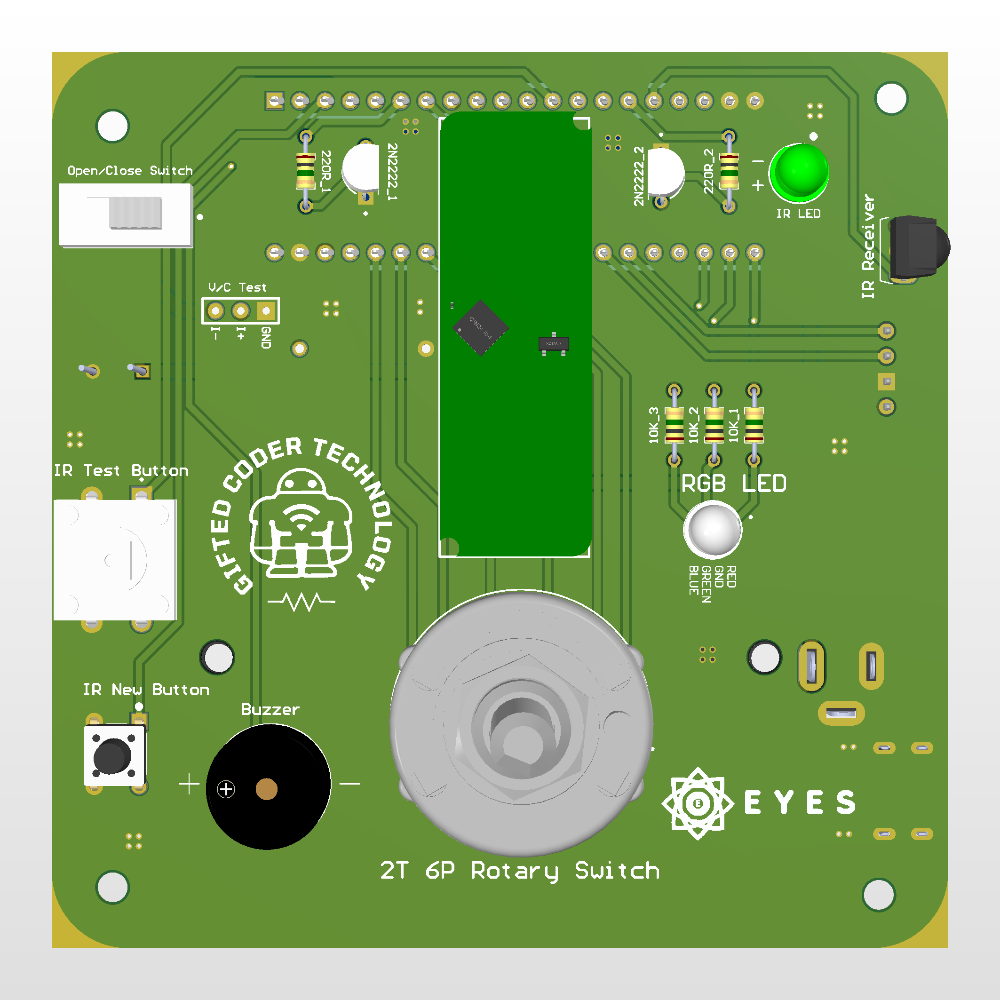

# Eyes-HVAC-v1

This is a autonomous air conditioner closing system. It scans the room for people where air conditioner is. And if there is not anyone in the room, it closes the air contitioner autonomaticly. Our system does not upload any software or hardware in the air conditioner for closing itself. It just copies the air conditioner's RC's closing signal and send the closing signal like the air conditioner's RC if there is not anyone in the room. Our system's human detection sensor must see all of them in the room and our system's IR LED must see air conditioner so it works perfect.

<!---->

Our system's software is just Arduino IDE software. It has written for stm32f103c8t6 blue pill.

It's Arduino IDE Libraries that you must upload: 
**STM32LowPower.h:** https://github.com/stm32duino/STM32LowPower/tree/main 
**IR_REMOTE.h:**     https://github.com/burakcanturk/IR_Remote 
**HLK_LD2450.h:**    https://github.com/burakcanturk/HLK_LD2450_Library 
